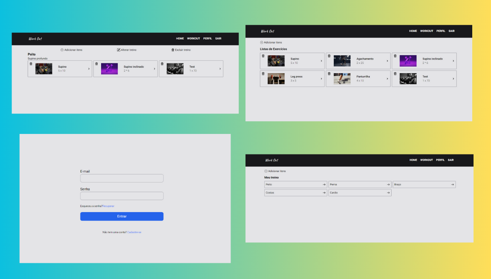
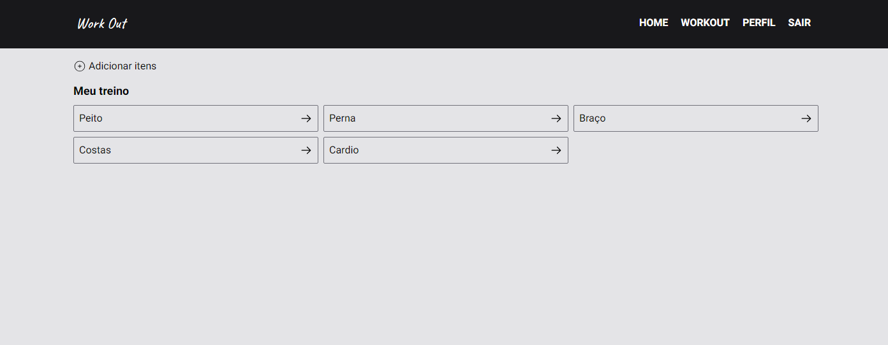
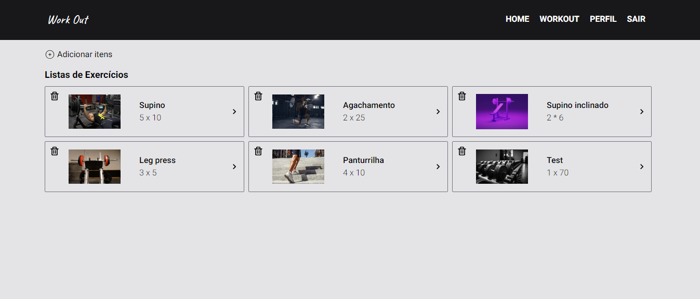

# Sistema de treino

O Sistema de Treino é uma aplicação completa que permite aos usuários gerenciar seus treinos de maneira simples e eficiente. 

## Requisitos do Sistema

Para operar o sistema, são necessários os seguintes requisitos mínimos na sua máquina: PHP, Composer, Node.js e Docker. O PHP e o Composer são essenciais para executar o Laravel, que contém a API principal do sistema. O Node.js é necessário para executar o front-end, enquanto o Docker é utilizado para virtualizar o ambiente no qual a API é executada. Estes componentes garantem a funcionalidade e o desempenho ideais do nosso sistema de forma integrada e eficiente.

## Requisitos Funcionais

### RF01. Login do usuário

- Informações: permitir que os usuários do aplicativo façam login com seus dados pessoais, e-mail e senha.

Regras

- Cadastro novo usuário: para criar um novo cadastro de usuário, o usuário deve fornecer um endereço de email e uma senha. Após o cadastro, um email de confirmação será enviado para o endereço de email fornecido, a fim de validar o novo cadastro do usuário.
- Esqueci a senha: o usuário esqueceu sua senha, logo é enviado um e-mail um token.
- Autenticação: O sistema deve verificar se as informações de login do usuário, verificar se já é cadastrado, caso o usuário já esteja cadastrado, mostra mensagem usuário cadastrado, se não houver cadastro daquele usuário segue a rotina normalmente.

### RF02. Gerenciamento de treinos

- Informações: permitir que o usuário da aplicação gerencie seu treino, fazendo o cadastro/excluindo os treinos...

Regras

- A aplicação deve permitir que o usuário cadastre novos treinos;
- A aplicação deve permitir que o usuário exclua treinos que não estejam mais em uso;
- A aplicação deve permitir que o usuário visualize todas as treinos cadastradas, com suas respectivas informações;
- A aplicação deve permitir que o usuário altere o treino de acordo com sua disponibilidade;

### RF03. Menu digital

- Informações: permitir que os usuários da aplicação visualizem o treino;

Regras:

- Permitir que os usuários visualizem o treino completo de forma digital;
- Fornecer imagens e descrições claras dos treinos;
- Permitir que os usuários visualizem os treinos e seja atualizado a qualquer tempo;
- Será de fácil utilização;

## Arquitetura do Sistema

O sistema utiliza as seguintes tecnologias:

- **Linguagens:** PHP, TypeScript
- **Banco de Dados:** MySQL
- **Frameworks:** Laravel^11, Next.js
- **Arquitetura da API:** MVC, RESTful
- **Outras Tecnologias:** React, Docker

### Observação

- O sistema utiliza filas (queues) no Laravel para enviar e-mails de forma assíncrona, funcionando em segundo plano.

## Como Iniciar o Sistema

### Passo 1: Download dos Arquivos

Clone o repositório:

```bash
git clone https://github.com/andre-albuquerque01/training-system
```

### Passo 2: Configuração do Back-end

Entre na pasta back-end:

```bash
cd /Api
```

Inicialize os pacotes do Laravel:

```php
composer install
```

Crie um arquivo `.env` na raiz do seu projeto e configure as variáveis de ambiente conforme necessário.
Execute `php artisan config:cache` para aplicar as configurações do arquivo `.env`.

Inicie o servidor da API:

```bash
./vendor/bin/sail up -d
```

Para desativar o servidor da API:

```bash
./vendor/bin/sail down
```

### Passo 3: Configuração do Front-end

Entre na pasta front-end:

```bash
cd ../app
```

Baixe as dependências do Node.js:

```bash
npm i
```

Inicie o servidor do Next.js:

```bash
npm run dev
```

### Passo 4: Acesso ao Sistema

Abra o navegador e acesse `http://localhost:3000` para utilizar o serviço.

### Imagens do sistema

#### A seguir, apresentamos algumas imagens que demonstram as funcionalidades do sistema:

- Início



- Dashboard



- Treino


